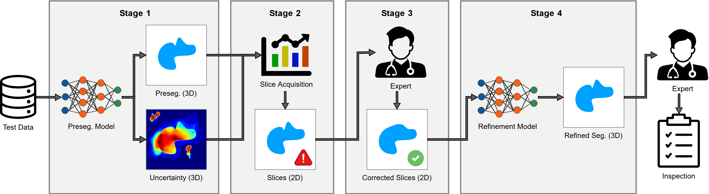
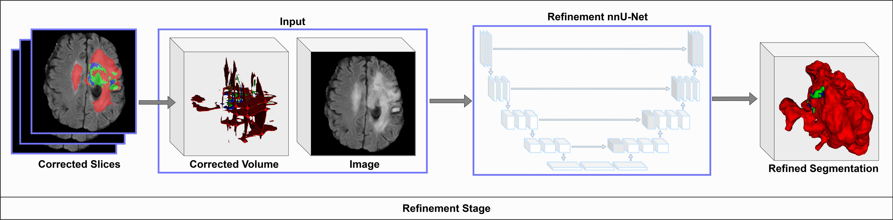
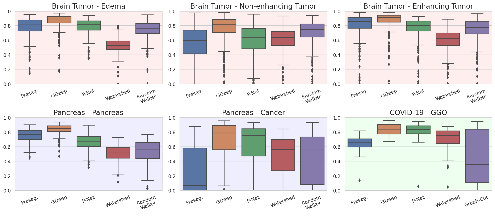
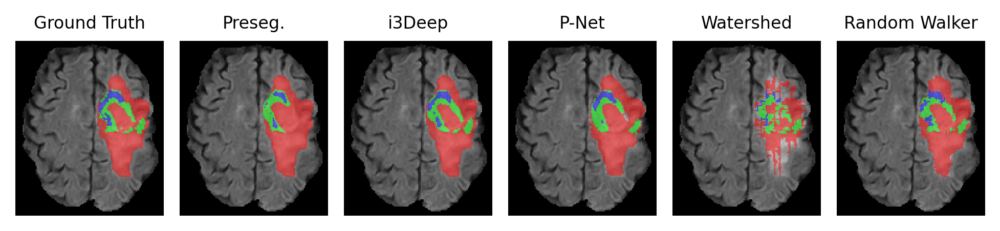
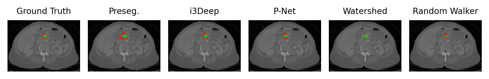
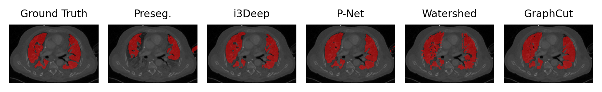

# i3Deep: Efficient 3D interactive segmentation with the nnU-Net

3D interactive segmentation is highly relevant in reducing the annotation time for experts. However, current methods often achieve only small segmentation improvements per interaction as lightweight models are a requirement to ensure near-realtime usage. Models with better predictive performance such as the nnU-Net cannot be employed for interactive segmentation due to their high computational demands, which result in long inference times. To solve this issue, we propose the 3D interactive segmentation framework i3Deep. Slices are selected through uncertainty estimation in an offline setting and afterwards corrected by an expert. The slices are then fed to a refinement nnU-Net, which significantly improves the global 3D segmentation from the local corrections. This approach bypasses the issue of long inference times by moving expensive computations into an offline setting that does not include the expert. For three different anatomies, our approach reduces the workload of the expert by 80.3%, while significantly improving the Dice by up to 39.5%, outperforming other state-of-the-art methods by a clear margin. Even on out-of-distribution data i3Deep is able to improve the segmentation by 19.3%.

## Architecture

The i3Deep framework uses the nnU-Net for both the presegmentation and refinement model, as it has a very high predictive performance and achieves state-of-the-art results
on many medical benchmarks. The i3Deep inference pipeline consists of four stages depicted in the Figure below:



1. The presegmentation model is used to run inference on new unseen subjects to provide presegmentations alongside uncertainties from the model.
2. A one-shot slice acquisition function selects multiple slices for each subject in axial, coronal and sagittal orientation from the 3D image based on the quantified uncertainties.
3. The acquired slices of the previous stage are sent to the expert for correction.
4. The corrected slices are projected into an empty volume back into their original positions. Then this volume is concatenated with the original image and used for inference by the refinement model, which significantly improves the segmentation (see Figure below).




## Results

We demonstrate the effectiveness of i3Deep with an evaluation on the brain tumor and pancreas datasets from the Medical Segmentation Decathlon and an out-of-distribution in-house chest CT scan dataset with COVID-19 lesions.
In the Figure below, the Dice score results of i3Deep against the presegmentation and multiple state-of-the-art baselines are shown:



### Qualitative examples

Below a qualitative comparisons on all three datasets is shown:

#### Brain tumor dataset:


#### Pancreas dataset:


#### COVID-19 dataset:


## Installation

Coming soon!

## Usage

Coming soon!

## Citation

Please consider to cite the i3Deep paper if you use it in your work:

```
@inproceedings{
gotkowski2022ideep,
title={i3Deep: Efficient 3D interactive segmentation with the nnU-Net},
author={Karol Gotkowski and Camila Gonzalez and Isabel Jasmin Kaltenborn and Ricarda Fischbach and Andreas Bucher and Anirban Mukhopadhyay},
booktitle={Medical Imaging with Deep Learning},
year={2022},
url={https://openreview.net/forum?id=R420Pr5vUj3}
}
```